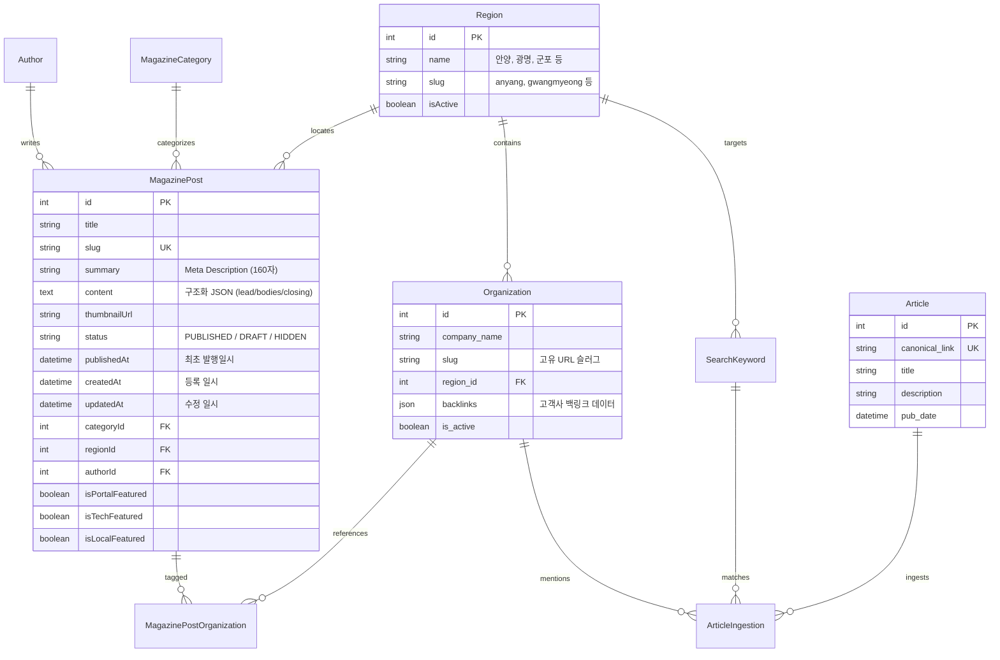

# ZINSIGHT (진사이트) 아키텍처 및 프로젝트 구조 가이드

> **AI-powered B2B Enterprise Profiling & Hybrid Business Media Platform**  
> 본 문서는 진사이트(Zinsight) 프로젝트의 최신 폴더 구조, 데이터 모델, 핵심 도메인 아키텍처 및 최근 고도화 작업 내역을 정리한 종합 가이드입니다.

---

## 🛠 1. 기술 스택 및 환경

| 분류 | 기술 및 라이브러리 |
| :--- | :--- |
| **Framework** | [Next.js 15+ (App Router)](https://nextjs.org/) with Turbopack |
| **Language** | [TypeScript 5+](https://www.typescriptlang.org/) (Strict Mode) |
| **ORM & DB** | [Prisma ORM 7+](https://www.prisma.io/) (`@prisma/adapter-mariadb`), MySQL / MariaDB |
| **Storage** | [Vercel Blob](https://vercel.com/docs/storage/vercel-blob) |
| **Styling & UI** | Tailwind CSS, [shadcn/ui](https://ui.shadcn.com/) (Radix UI), Lucide Icons |
| **Charts** | Recharts |
| **Data APIs** | Naver Search News API, Google Analytics Data API (GA4), Google Search Console API |
| **Excel Export**| SheetJS (`xlsx`) |

---

## 📂 2. 최신 디렉토리 구조 (Directory Structure)

Route Groups(`(public)`)를 통해 일반 사용자 지면과 관리자 CMS(`admin`)를 명확히 분리하고 있습니다.

```text
zinsight/
├── prisma/
│   ├── schema.prisma             # 최신 통합 데이터베이스 스키마
│   └── migrations/               # Prisma 마이그레이션 이력
├── src/
│   ├── actions/                  # Next.js Server Actions
│   │   ├── admin/                # 관리자 전용 서버 액션
│   │   │   ├── analytics-actions.ts    # GA4/GSC 통계 및 리포트 생성 액션
│   │   │   ├── author-actions.ts       # 기명 필진(저자) 관리 CRUD
│   │   │   ├── company-actions.ts      # 관내 기업/기관 관리 CRUD
│   │   │   ├── export-actions.ts       # 월간 엑셀 스냅샷 생성 및 다운로드
│   │   │   ├── headline-actions.ts     # 포털/테크/로컬 피처드 헤드라인 우선순위
│   │   │   ├── magazine-actions.ts     # 매거진 포스트 CRUD, 본문 파싱, 슬러그 생성
│   │   │   └── region-actions.ts       # 활성 지자체(Region) 관리
│   │   ├── public/               # 일반 사용자 공개 페이지용 서버 액션
│   │   │   └── magazine-actions.ts     # 매거진 공개 목록 및 태그별 조회
│   │   ├── dashboard-actions.ts  # 관리자 대시보드 요약 지표 집계
│   │   ├── ingest-actions.ts     # 네이버 뉴스 자동 크롤링 및 중복 필터링
│   │   └── insight-radar-actions.ts # 관내 기업 프로필 및 레이더 검색/필터 액션
│   ├── app/
│   │   ├── (public)/             # 공개 프론트엔드 라우트 그룹 (URL에 노출되지 않음)
│   │   │   ├── page.tsx          # 메인 랜딩 (인사이트 레이더 요약 + 매거진 캐러셀)
│   │   │   ├── insight-radar/    # 인사이트 레이더 허브 (/insight-radar)
│   │   │   │   ├── page.tsx      # 관내 기업/기관 검색 및 디렉토리
│   │   │   │   └── [id]/page.tsx # 기업 상세 프로필 (ID 또는 Slug 기반 301 지원)
│   │   │   ├── magazine/         # 매거진 허브 (/magazine)
│   │   │   │   ├── page.tsx      # 매거진 포털 (최신 피처드 + 헤드라인)
│   │   │   │   ├── tech-marketing/ # 테크·마케팅 전용 지면 (/magazine/tech-marketing)
│   │   │   │   │   ├── page.tsx
│   │   │   │   │   └── [slug]/page.tsx # 테크 기사 상세 (JSON-LD NewsArticle 스키마)
│   │   │   │   ├── local/        # 로컬 비즈니스 허브 (/magazine/local)
│   │   │   │   │   ├── page.tsx  # 지자체 선택 허브
│   │   │   │   │   └── [region]/
│   │   │   │   │       ├── page.tsx # 특정 지자체 지면 (/magazine/local/anyang 등)
│   │   │   │   │       └── [slug]/page.tsx # 로컬 기사 상세
│   │   │   │   ├── tags/
│   │   │   │   │   └── [slug]/page.tsx # 태그 아카이브 지면 (/magazine/tags/[slug])
│   │   │   │   └── authors/
│   │   │   │       └── [slug]/page.tsx # 기자/필진 프로필 지면 (/magazine/authors/[slug])
│   │   │   ├── privacy/page.tsx  # 개인정보처리방침
│   │   │   ├── terms/page.tsx    # 이용약관
│   │   │   └── layout.tsx        # 공개 페이지 GNB, Footer 공통 레이아웃
│   │   ├── admin/                # 관리자 CMS 라우트 (/admin/* - noindex 설정)
│   │   │   ├── page.tsx          # 관리자 대시보드
│   │   │   ├── magazine/         # 매거진 포스트 목록 (/admin/magazine)
│   │   │   │   ├── new/page.tsx  # 신규 포스트 작성 에디터
│   │   │   │   ├── edit/[id]/    # 포스트 수정 및 상세
│   │   │   │   │   ├── page.tsx
│   │   │   │   │   └── analytics/page.tsx # 기사별 GA4/GSC 심층 성과 분석
│   │   │   │   ├── headlines/page.tsx # 홈/테크/로컬 피처드 우선순위 배치
│   │   │   │   ├── authors/page.tsx   # 필진 관리
│   │   │   │   └── regions/page.tsx   # 지자체 관리
│   │   │   ├── companies/        # 관내 기업/기관 관리
│   │   │   │   ├── page.tsx
│   │   │   │   └── [id]/analytics/page.tsx # 기업 프로필 성과 분석
│   │   │   ├── keywords/page.tsx # 수집 키워드 관리
│   │   │   ├── articles/page.tsx # 수집 뉴스 기사 관리
│   │   │   ├── analytics/reports/ # 성과 리포트 스냅샷 관리 (F-11-A)
│   │   │   ├── storage/page.tsx  # Vercel Blob 이미지 스토리지 관리
│   │   │   ├── export/page.tsx   # 엑셀 데이터 스냅샷 추출
│   │   │   ├── settings/redirects/ # 301 URL 리다이렉트 관리
│   │   │   └── layout.tsx        # 관리자 전용 사이드바 레이아웃 (색인 방지 메타태그)
│   │   ├── api/                  # 서버리스 API 엔드포인트
│   │   │   ├── auth/             # 관리자 로그인 및 개별 2FA 인증 (TOTP/QR)
│   │   │   ├── companies/import/ # 기업 대량 엑셀/JSON 임포트
│   │   │   └── snapshots/        # 스냅샷 다운로드
│   │   ├── robots.txt/route.ts   # 동적 robots.txt (/admin 차단 및 sitemap 명시)
│   │   ├── rss.xml/route.ts      # 매거진 RSS 2.0 표준 피드
│   │   ├── sitemap.ts            # 동적 sitemap.xml (발행 기사, 기업, 지역 자동 반영)
│   │   ├── layout.tsx            # 최상위 루트 레이아웃 (Inter/Pretendard 폰트)
│   │   └── globals.css           # Tailwind CSS 및 Zinsight 디자인 토큰
│   ├── components/
│   │   ├── admin/                # 관리자 전용 UI 컴포넌트
│   │   │   ├── magazine/         # MagazineForm, ImageDetailsModal, LinkInsertModal 등
│   │   │   ├── analytics/        # GA4/GSC 차트, 리포트 모달
│   │   │   └── companies/        # 기업 관리 및 임포트 모달
│   │   ├── public/               # 일반 사용자용 UI 컴포넌트
│   │   │   ├── magazine/         # MagazinePostDetail (마크다운 파서, 캡션 렌더링)
│   │   │   └── insight-radar/    # RadarCompanyCard, RadarSearchBar 등
│   │   ├── layout/               # GNB, Footer, AdminSidebar
│   │   └── ui/                   # shadcn/ui 기반 아토믹 컴포넌트
│   ├── lib/
│   │   ├── analytics/            # GA4 Client, GSC Client, 구글 서비스 계정 인증
│   │   ├── db.ts                 # Prisma Client 인스턴스 (MariaDB 어댑터)
│   │   └── utils.ts              # cn 헬퍼 및 공통 유틸리티
│   └── middleware.ts             # www 301 강제 리다이렉트 및 보안 미들웨어
├── package.json
└── README.md
```

---

## 🗄️ 3. 핵심 데이터베이스 스키마 구조 (`schema.prisma`)

기존 레거시 `Industry` 체계를 완전히 걷어내고, **`Region`(지자체)**을 최상위 도메인 축으로 하는 구조로 전면 개편되었습니다.



---

## 📌 4. 주요 고도화 및 작업 내역 요약

### 1) 매거진 CMS 및 에디터 고도화
- **구조화 3단 본문 에디터 (Structured JSON)**:
  - 본문을 리드(`lead`) - 본문 섹션(`bodies: [{title, content}]`) - 클로징(`closing`)의 3단 구조로 저장·렌더링하여 표준화된 매거진 레이아웃 유지.
  - 엔터 키 입력 시 의도치 않게 포스트가 자동 제출/발행되는 현상 방지.
- **시맨틱 이미지 시스템 v2.0**:
  - `ImageDetailsModal`을 통한 대체 텍스트(`alt`)와 캡션(`figcaption`) 분리 입력.
  - 캡션 내 큰따옴표(`"`) 포함 시 홑따옴표(`'`) 또는 괄호 `(caption)`로의 **자동 델리미터 폴백(Fallback)** 처리.
  - 본문 이미지 `` 속성 부여로 초기 로딩 성능 최적화.
- **외부 링크 및 저널리즘 rel 속성 분리**:
  - `LinkInsertModal`에서 링크 삽입 시 '근거 링크(일반)'와 '고객사·파트너 링크(Sponsored)' 선택 지원.
  - 고객사 링크는 `rel="sponsored noopener"`로, 일반 링크는 리퍼러를 보존하는 `rel="noopener"`로 전환 (`noreferrer` 제거).
- **Meta Description 및 요약 필드 독립화**:
  - 에디터 내 전용 요약 입력 폼(160자 카운터) 제공. 미입력 시 리드 첫 부분을 문장 단위(`.?!`)로 정밀 절삭(155자 내외)하여 자동 생성.
  - 리드 요약 태그를 `<h2>`에서 시맨틱 `<p>` 태그로 변경하여 제목 계층 구조 정리.
- **임시저장(DRAFT) 및 발행 프로세스 분리**:
  - `publishedAt`(최초 발행일시)과 `createdAt`(최초 등록일시), `updatedAt`(수정일시) 분리 관리.
  - 임시저장(초안) 상태에서는 본문/클로징 미완성 상태여도 제목과 메타 설명이 안전하게 보존되도록 유효성 검사 완화.
  - 에디터 하단에 **[임시저장]** 전용 버튼 추가 및 선택 상태 왜곡 버그 해결.
- **매거진 목록 테이블 개선**:
  - 관리자 목록에서 **`등록일`**과 **`발행일`**(초안은 '미발행' 배지)을 별도 컬럼으로 구분 표기.
  - 우측 상세 시트 드로어에서 요약문 조회/수정 및 세부 일시(등록/발행/수정) 정보 제공.
- **태그 아카이브 지면 신설**:
  - 기존 `?q=` 쿼리 파라미터 검색 방식 대신 `/magazine/tags/[slug]` 정식 아카이브 라우트 구축 및 SEO 동적 메타데이터 적용.

### 2) 인사이트 레이더 (Region 중심 재편)
- 레거시 `Industry` 체계를 완전히 폐지하고 **`Region`(지자체)** 기준으로 관내 기업·기관을 100% 통합.
- 기업 프로필에 영문 슬러그(`slug`)를 도입하고 `id`와 `slug` 접근 시 표준 URL로 301 영구 리다이렉트 처리.
- 관내 기업 상세 페이지에서 실시간 크롤링된 관련 뉴스 피드 연동.

### 3) 검색엔진 최적화 (SEO) 및 인프라 표준화
- **`www.zinsight.co.kr` 단일 도메인 통일**:
  - `middleware.ts`에서 `zinsight.co.kr` 접속 시 `www.zinsight.co.kr`로 301 영구 리다이렉트.
  - 전역 `metadataBase`, `canonical`, OpenGraph URL, JSON-LD의 Base URL 통일.
- **`/admin` 검색엔진 색인 원천 방지**:
  - `robots.txt`에 `Disallow: /admin` 명시 및 `admin/layout.tsx`에 `robots: { index: false, follow: false }` 메타태그 적용.
- **실시간 사이트맵/피드 캐시 갱신**:
  - 기사 저장/발행 및 상태 변경 시 `revalidatePath('/sitemap.xml')`과 `revalidatePath('/rss.xml')`을 트리거하여 검색 크롤러에 최신 상태 즉시 전달.
  - `sitemap.xml`은 오직 `status: 'PUBLISHED'`인 기사만 노출.

### 4) 엔터프라이즈 애널리틱스 연동 (F-01 ~ F-13)
- Google Analytics 4 (GA4) 및 Google Search Console (GSC) 실데이터 연동.
- 유입 채널 5단계 세분화 (AI 서비스, 검색엔진, SNS, 직접 방문, 기타 리퍼럴).
- GA4 API 쿼터 초과 방지를 위한 일괄 쿼리(`getBatchArticlesStats`) 최적화.
- 클라이언트 보고용 리포트 스냅샷 이력 관리(`AnalyticsReport`).

---

## 🔒 5. 개발 및 운영 시 준수 규칙 (`.agents/AGENTS.md`)

1. **빌드 최소화**: 사소한 마크업 및 CSS 변경 시 `pnpm build`를 남발하지 않고 `pnpm tsc --noEmit`을 통한 정적 타입 검증을 우선합니다.
2. **데이터베이스 직접 조작 금지**: 에이전트가 직접 DML(INSERT / UPDATE / DELETE) 스크립트를 원격 DB에 실행하지 않으며, 필요한 SQL을 정리하여 보고합니다.
3. **한글 Git 커밋 메시지**: 모든 Git 커밋 메시지는 반드시 명확한 단위 작업별로 분리하여 한글로만 작성합니다.
